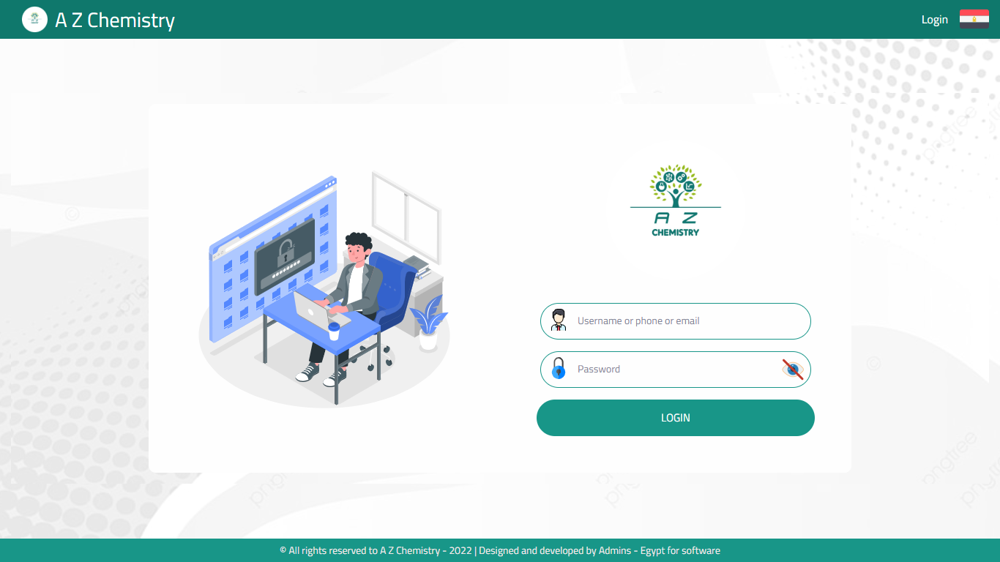

# A Z Chemistry

A Z Chemistry is a places learning system.

Where the management of educational levels, study materials, courses and diplomas and dividing them into groups to accommodate students in these groups. With more features including attendance, absence, subscriptions, rating, tracking students’ exams, students’ grads, schedules, upload various media, tracking students’ complaints to solve their problems, manage expenses, revenues and net profit. And get all reports you need.

---
## login

---

### See all projects

Github
[moelsohagy](https://github.com/moelsohagy).

---
