# A Z Chemistry

A Z Chemistry is a places learning system.

Where the management of educational levels, study materials, courses and diplomas and dividing them into groups to accommodate students in these groups. With more features including attendance, absence, subscriptions, rating, tracking students’ exams, students’ grads, schedules, upload various media, tracking students’ complaints to solve their problems, manage expenses, revenues and net profit. And get all reports you need.

---

## System support two languages (Arabic & English)

---

---

- # System overview

## login page

---

## Joining applications (en & ar)

- English view
  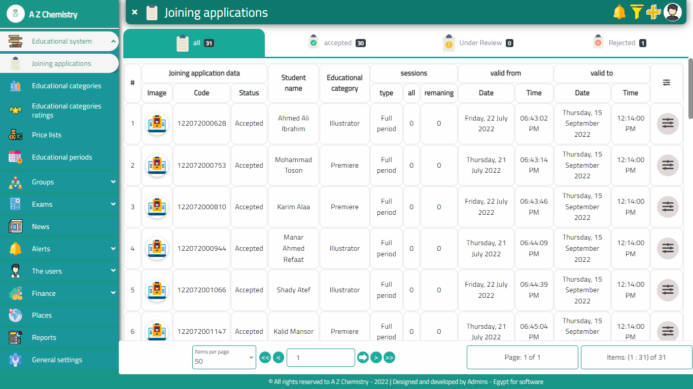

- Arabic view
  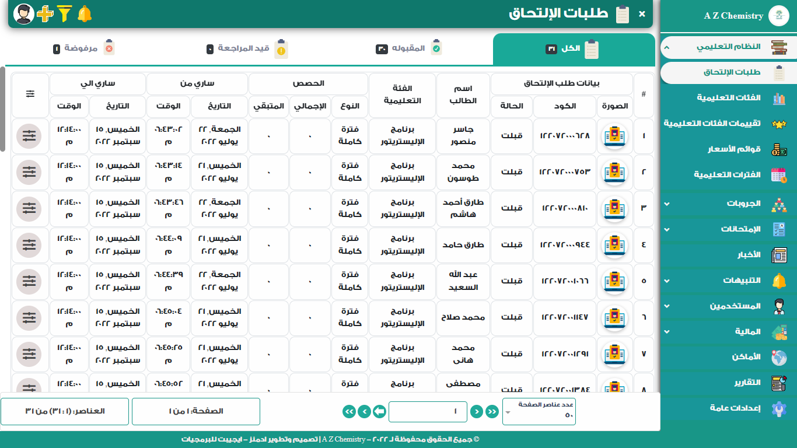

## Educational groups

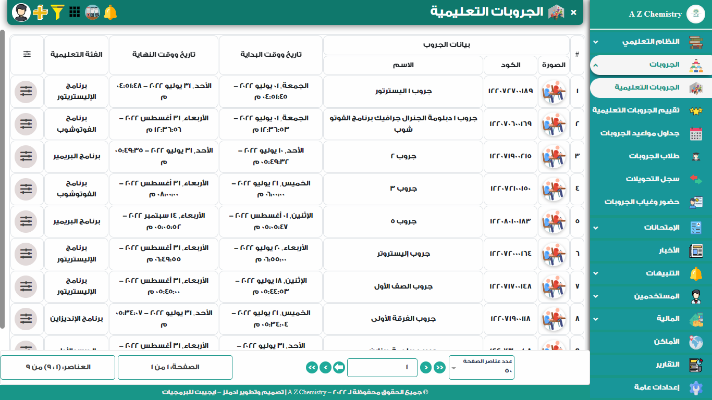

## Attendance

- By QR Code
  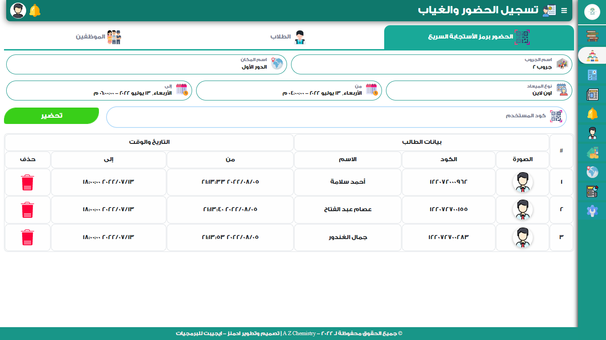

- Manual
  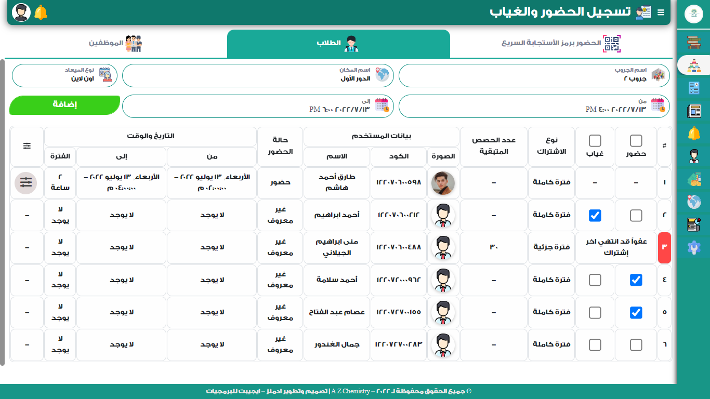

## Exams models

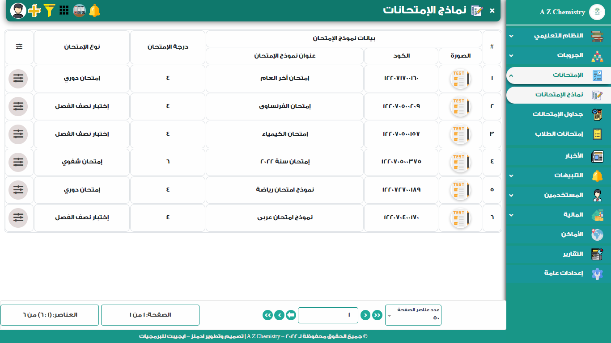

## Schedule exams

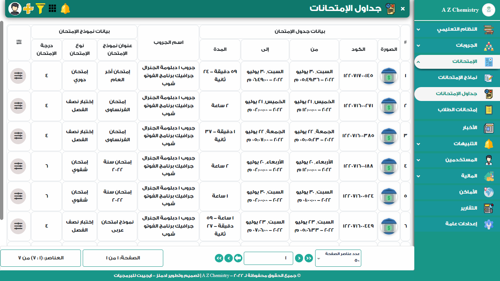

## Complaints

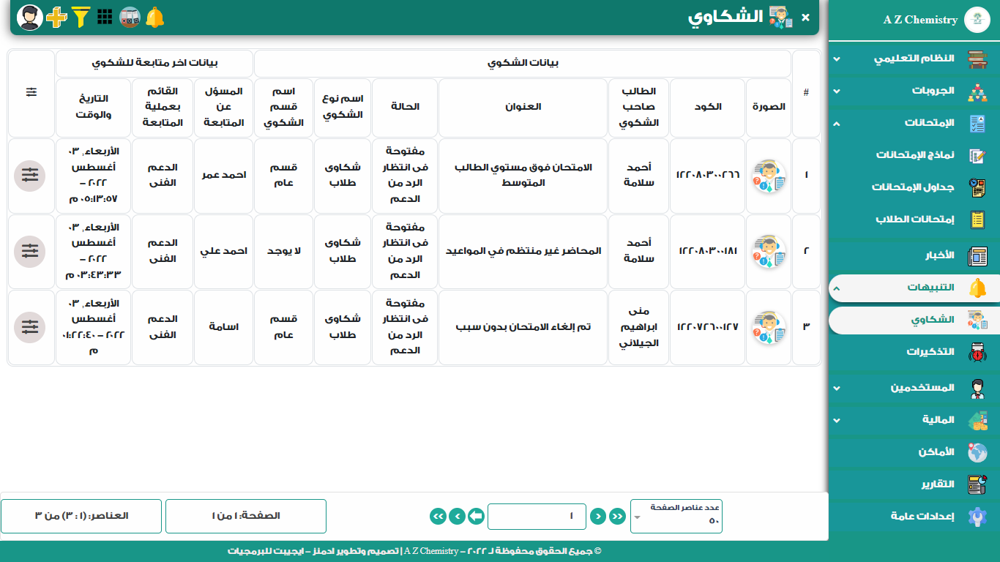

---

# Students, employees & system owners (the same)

## Students

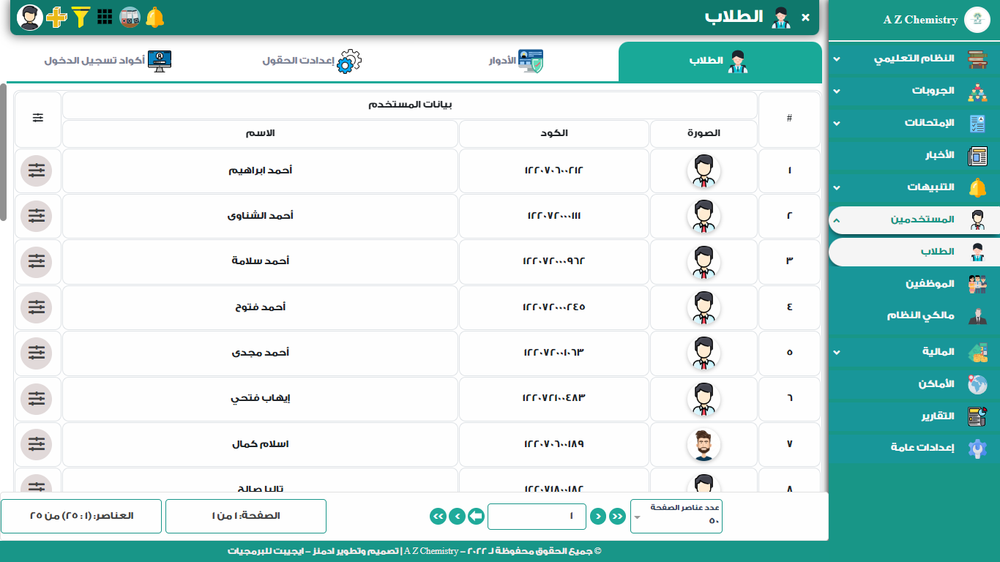

## Students roles for privileges

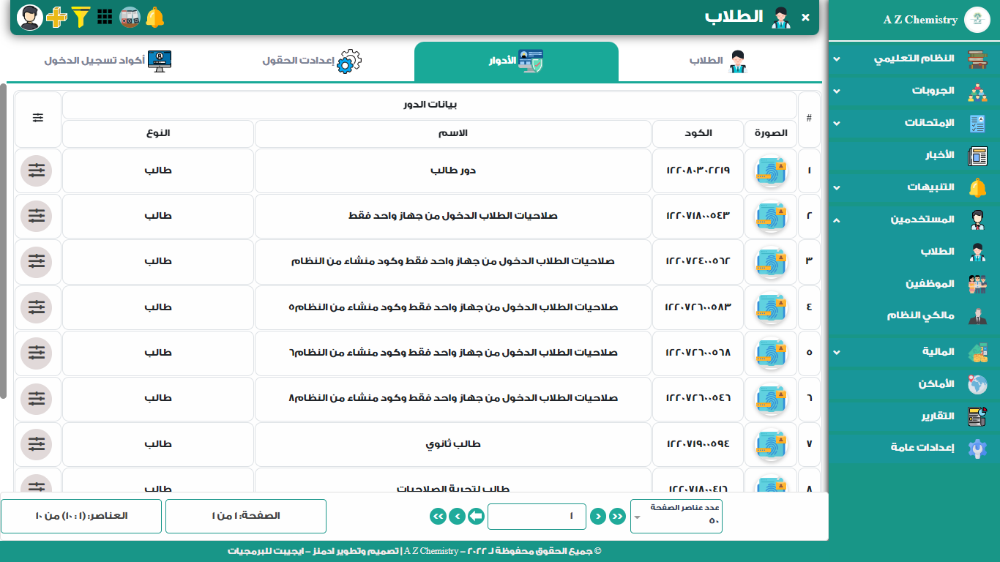

## Students login codes (code for user to login to system)

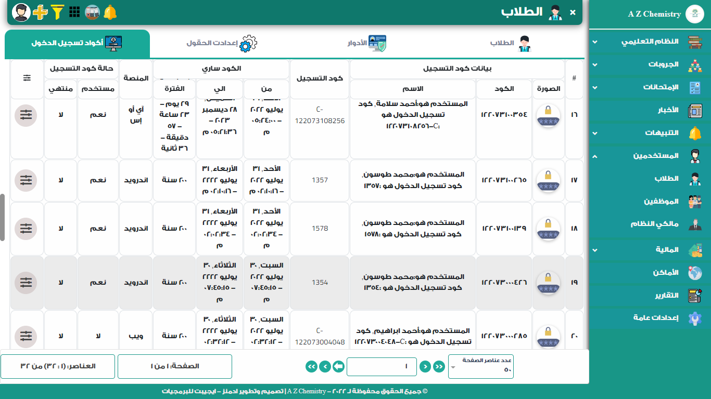

---

## Accounts transactions

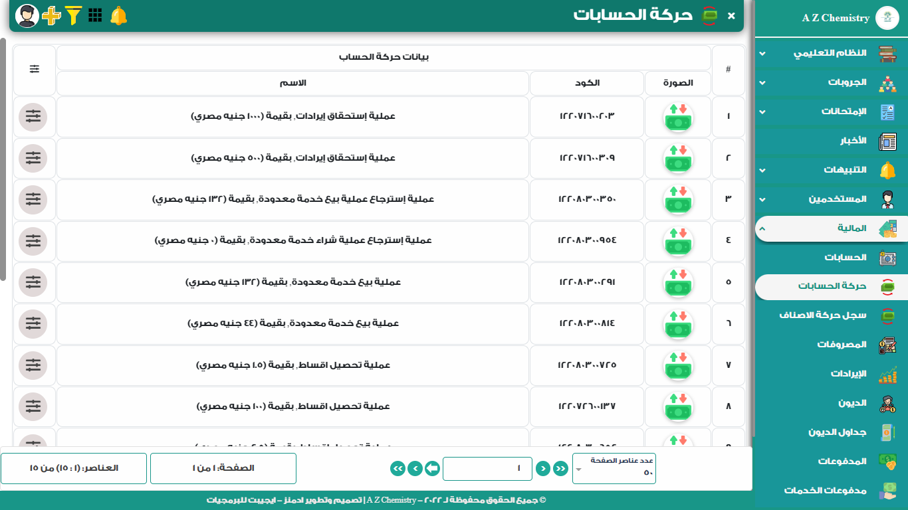

## Debts

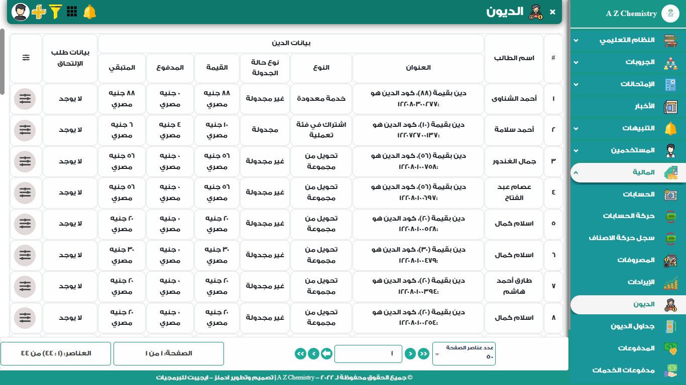

---

## Reports

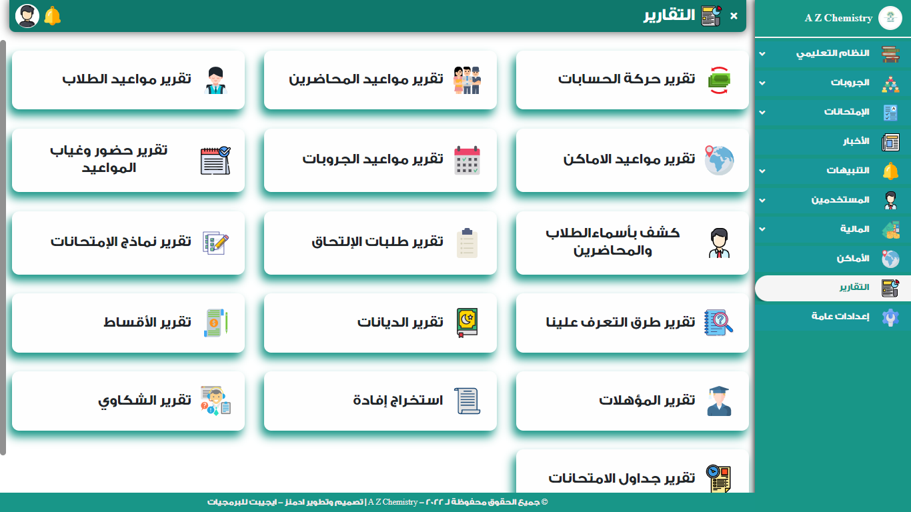

---

## Additional settings

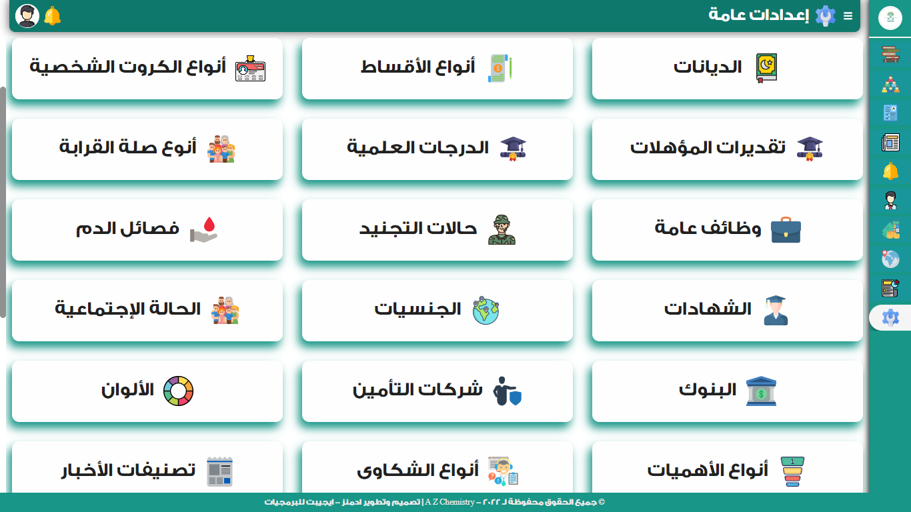

### See all projects

Github [moelsohagy](https://github.com/moelsohagy).

---
